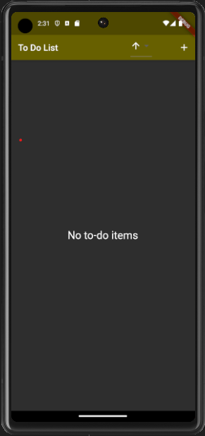
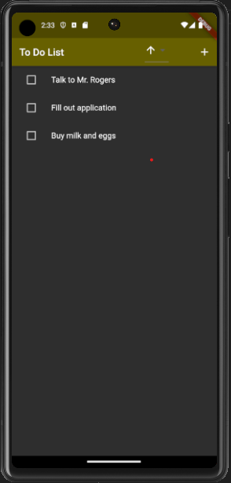

# Todo List

A simple to-do list application that allows users to add, remove, and sort to-do items.

# Status
- [x] Able to add items
- [x] Able to remove items
- [x] Use Flutter Riverpod to outsource database manipulation functions
- [x] Use sqflite package to store to-do items in an on-device database
- [ ] Able to sort items by created date
- [ ] Able to create different to-do lists for different categories (work, personal, etc.)
